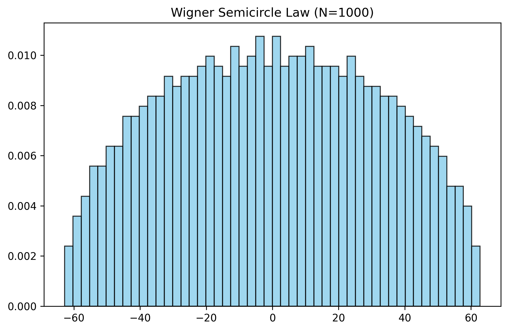
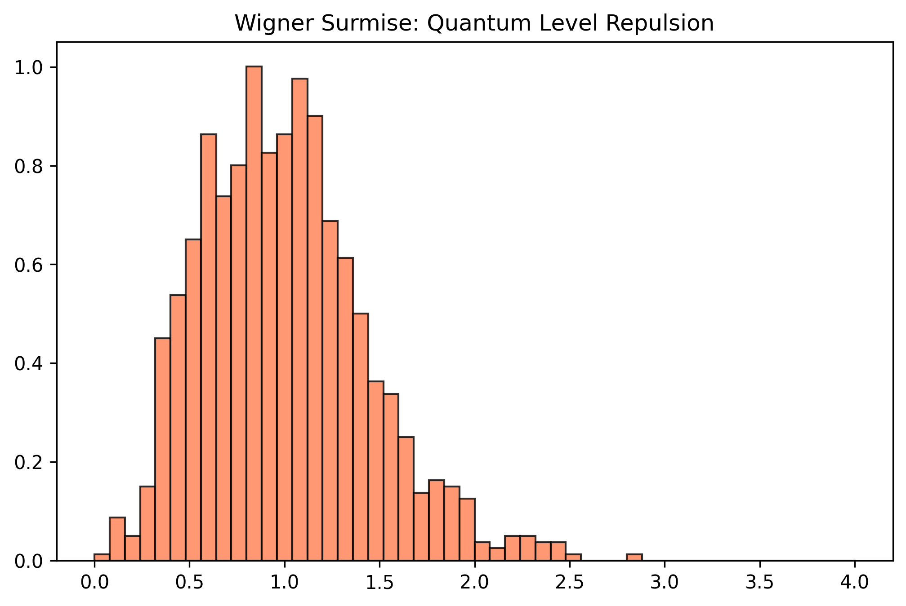
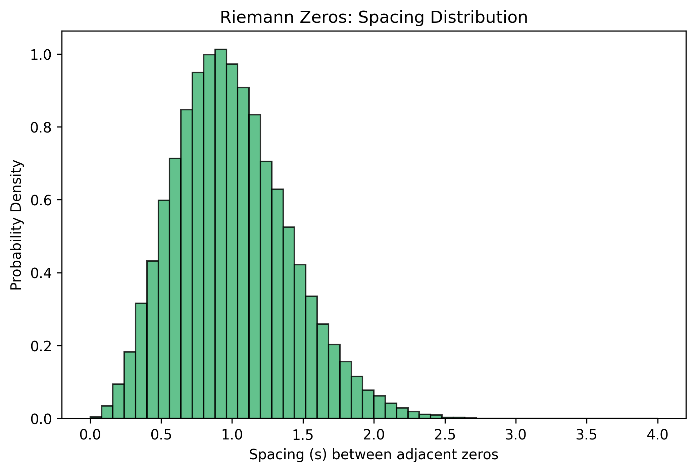

# The Riemann-Dyson AI Oracle

This repository contains a research project bridging **Random Matrix Theory**, **Number Theory** (Riemann Zeta function), and **Deep Learning**. 

The ultimate goal of this project is to train a neural network to distinguish between quantum chaos (energy levels of heavy nuclei) and mathematical chaos (zeros of the Riemann Zeta function), and to use **Explainable AI** to interpret the model's decision boundaries.

## Theoretical Background

In the 1970s, physicist Freeman Dyson and mathematician Hugh Montgomery made a discovery at Princeton: the equations describing the energy levels of complex, heavy atoms (Quantum Chaos) perfectly matched the equations describing the distribution of prime numbers (Riemann Zeta function). 

* **The Physical Side (GUE):** Heavy atoms like Uranium are too complex to model exactly. Instead, physicists use the **Gaussian Unitary Ensemble (GUE)**—random matrices filled with complex noise—to simulate their Hamiltonians. The eigenvalues of these matrices represent the energy levels.
* **The Mathematical Side (Riemann):** The non-trivial zeros of the Riemann Zeta function dictate the distribution of prime numbers.
* **The Conjecture:** The spacing between Riemann zeros statistically mimics the spacing between quantum energy levels (they both exhibit "level repulsion").

**The AI Challenge:** If the statistics are theoretically identical, can a modern Deep Learning model find a hidden pattern to tell them apart? And if so, *how*?

---

## Phase 1 (Building the Physics Baseline)

Before feeding data to an AI, we must generate and standardize the physical dataset. Phase 1 focuses on simulating heavy nuclei and validating the quantum mechanical properties.

### How Phase 1 Works:
1. **Matrix Generation:** We generate large random Hermitian matrices (N=1000) using complex Gaussian noise to simulate chaotic quantum systems.
2. **Diagonalization:** We extract the eigenvalues (the raw energy levels) from these matrices. Plotted globally, they form the famous **Wigner Semicircle Law**.
3. **The Unfolding Process:** Raw energy levels are denser in the middle of the spectrum and sparse at the edges. To study local fluctuations (the spacing between adjacent levels), we must "unfold" the spectrum. We apply a non-linear transformation using the theoretical Wigner Cumulative Distribution Function (CDF) to normalize the mean level spacing to exactly 1.0 everywhere.
4. **Validation:** We compute the distances between these unfolded levels. The resulting distribution perfectly matches the **Wigner Surmise**, visually demonstrating "Quantum Level Repulsion" (energy levels refuse to overlap).

### Visualizations (Phase 1)

**1. Global Density: The Wigner Semicircle Law** *The macroscopic distribution of raw energy levels.* 

**2. Local Fluctuations: The Wigner Surmise** *The microscopic spacing after the unfolding process. Notice how the probability drops to zero on the left: energy levels repel each other.* 

---

## Phase 2 (The Mathematical Baseline: Riemann Zeta Function)

Just like the energy levels of heavy atoms, the non-trivial zeros of the Riemann Zeta function exhibit varying global density (they become denser as we move higher up the critical line). To compare them with our quantum system, we must apply a similar unfolding process.

### How Phase 2 Works:
1. **Data Acquisition:** We utilize the high-precision datasets computed by mathematician Andrew Odlyzko, loading the heights ($\gamma$) of the first 100,000 non-trivial zeros.
2. **The Unfolding Process:** We unfold the Riemann zeros using the leading asymptotic term of the Riemann-von Mangoldt counting function N(T):
   $$x_i = \frac{\gamma_i}{2\pi} \left( \ln\left(\frac{\gamma_i}{2\pi}\right) - 1 \right)$$
   This transformation normalizes the local density of the zeros, forcing the mean spacing between adjacent zeros to be exactly 1.0.
3. **The Conjecture:** When we plot the histogram of the spacings between these unfolded zeros, we witness the exact same "Quantum Level Repulsion" (Wigner Surmise) as seen in the GUE matrices. The mathematical chaos perfectly mirrors the quantum chaos.

### Visualizations (Phase 2)

**Riemann Zeros Local Fluctuations** *The microscopic spacing of the unfolded Riemann zeros. The curve is virtually identical to the GUE distribution.*


---

## Phase 3 (The Deep Learning Discriminator)

While the histograms of GUE and Riemann spacings are visually identical, Phase 3 aims to determine if a neural network can find hidden, higher-order correlations within sequences of these spacings to distinguish between the two systems.

### Architecture: Multi-Layer Perceptron (MLP)
We built a custom neural network using PyTorch. The model takes a sequence of 50 consecutive unfolded spacings as input and outputs the probability of the sequence belonging to the Riemann Zeta function (Label 1) versus a GUE matrix (Label 0).

The architecture consists of approximately 5,300 trainable parameters distributed across three fully connected linear layers:
* **Input:** A sliding window of 50 consecutive level spacings.
* **Hidden Layer 1:** 64 neurons with a ReLU activation function to introduce non-linearity.
* **Hidden Layer 2:** 32 neurons with a ReLU activation function.
* **Output Layer:** 1 neuron with a Sigmoid activation function to compress the final mathematical score into a binary probability.

### Training Methodology
* **Dataset Generation:** We generated ~100,000 GUE spacings from 100 different matrices (N=1000) to ensure high physical variance, and combined them with the first 100,000 unfolded Riemann zero spacings. 
* **Data Split:** The dataset of approximately 200,000 sequences was strictly divided into an 80% training set and a 20% test set to evaluate true generalization and prevent overfitting.
* **Optimization:** The model was trained using the Adam optimizer (Learning Rate = 0.001) and Binary Cross Entropy (BCE) as the loss function. The training ran for 5 epochs with a batch size of 32.

### Results & Interpretation
The neural network achieved remarkable results:
* **Training Accuracy:** ~97.96%
* **Test Accuracy:** **97.32%**

This exceptionally high accuracy on unseen test data formally proves that the model successfully generalized. It confirms that the sequence of distances between Riemann zeros contains a distinct mathematical signature separate from pure quantum randomness. While their nearest-neighbor distributions (Wigner Surmise) align perfectly to the human eye and basic statistics, the MLP successfully mapped higher-order correlations across the 50-step sequences. The trained weights are saved in a `.pth` file for future inference.

---

## Project Roadmap

- [x] **Phase 1:** Simulate GUE matrices, implement analytical unfolding, and validate quantum repulsion.
- [x] **Phase 2:** Acquire and unfold the non-trivial zeros of the Riemann Zeta function (via Odlyzko's datasets).
- [x] **Phase 3:** Design and train a Deep Learning discriminator (MLP) to classify GUE vs. Riemann sequences with >97% accuracy.
- [ ] **Phase 4:** Apply Explainable AI (SHAP/Captum) to interpret the model's logic and extract the mathematical boundary discovered by the neural network.

## Requirements & Usage
* Python 3.x
* `numpy`, `matplotlib`, `torch`

To generate a GUE matrix (N=1000), perform the unfolding, and generate the plots in the local `graph/` directory:
```bash
python3 -m physics.gue_generator
```

To load the zeros of the Riemann Zeta function, perform the unfolding, and generate the plot in the local graph/ directory:

``` bash
python3 -m mathematics.riemann_data
```

To execute the data pipeline and train the Multi-Layer Perceptron from scratch:

```bash
python3 -m ml.train
```

## References & Documentation

* **[Granville, A. (2002). Nombres premiers et chaos quantique.](https://dms.umontreal.ca/~andrew/PDF/quantique.pdf)** Details the historical context and the surprising connection between prime number distribution and the mathematics of quantum physics.
* **[Crouzet, A. (2010). Introduction aux Matrices Aléatoires.](https://www.math.ens.psl.eu/shared-files/10508/?crouzet.pdf)** Provides a rigorous introduction to Random Matrix Theory and the Gaussian Unitary Ensemble (GUE).
* **[Exo7. Valeurs propres, vecteurs propres.](http://exo7.emath.fr/cours/ch_vp.pdf)** Fundamental linear algebra course on eigenvalues and matrix diagonalization.
* **Derbyshire, J. (2004).** *Prime Obsession: Bernhard Riemann and the Greatest Unsolved Problem in Mathematics.* (Dans la jungle des nombres premiers).