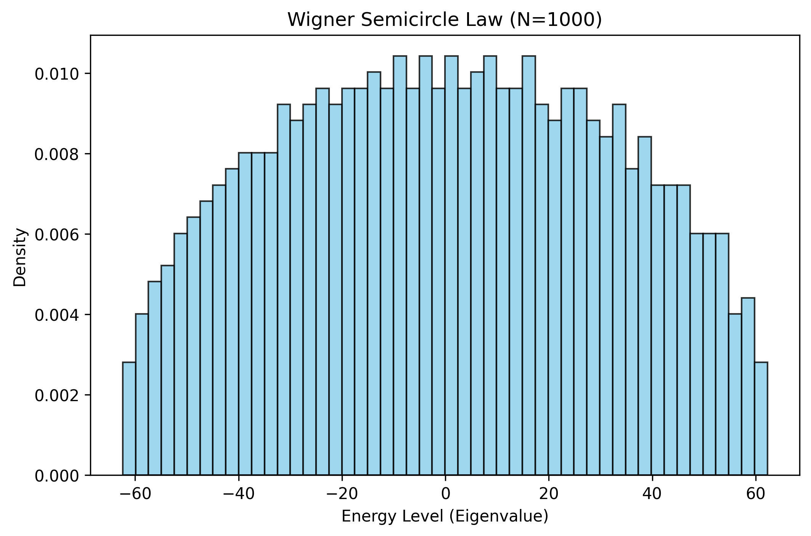
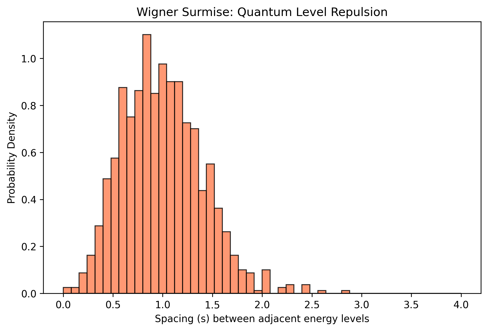

# The Riemann-Dyson AI Oracle

This repository contains an ongoing 10-month research project bridging **Random Matrix Theory**, **Number Theory** (Riemann Zeta function), and **Deep Learning**. 

The ultimate goal of this project is to train a neural network to distinguish between quantum chaos (energy levels of heavy nuclei) and mathematical chaos (zeros of the Riemann Zeta function), and to use **Explainable AI (XAI)** to interpret the model's decision boundaries.

## Theoretical Background

In the 1970s, physicist Freeman Dyson and mathematician Hugh Montgomery made a serendipitous discovery over tea at Princeton: the equations describing the energy levels of complex, heavy atoms (Quantum Chaos) perfectly matched the equations describing the distribution of prime numbers (Riemann Zeta function). 

* **The Physical Side (GUE):** Heavy atoms like Uranium are too complex to model exactly. Instead, physicists use the **Gaussian Unitary Ensemble (GUE)**—random matrices filled with complex noise—to simulate their Hamiltonians. The eigenvalues of these matrices represent the energy levels.
* **The Mathematical Side (Riemann):** The non-trivial zeros of the Riemann Zeta function dictate the distribution of prime numbers.
* **The Conjecture:** The spacing between Riemann zeros statistically mimics the spacing between quantum energy levels (they both exhibit "level repulsion").

**The AI Challenge:** If the statistics are theoretically identical, can a modern Deep Learning model (like a Transformer or CNN) find a hidden pattern to tell them apart? And if so, *how*?

---

## Current State: Phase 1 (Building the Physics Baseline)

Before feeding data to an AI, we must generate and standardize the physical dataset. Phase 1 focuses on simulating heavy nuclei and validating the quantum mechanical properties.

### How Phase 1 Works:
1. **Matrix Generation:** We generate large random Hermitian matrices ($N=1000$) using complex Gaussian noise to simulate chaotic quantum systems.
2. **Diagonalization:** We extract the eigenvalues (the raw energy levels) from these matrices. Plotted globally, they form the famous **Wigner Semicircle Law**.
3. **The Unfolding Process:** Raw energy levels are denser in the middle of the spectrum and sparse at the edges. To study local fluctuations (the spacing between adjacent levels), we must "unfold" the spectrum. We apply a non-linear transformation using the theoretical Wigner Cumulative Distribution Function (CDF) to normalize the mean level spacing to exactly $1.0$ everywhere.
4. **Validation:** We compute the distances between these unfolded levels. The resulting distribution perfectly matches the **Wigner Surmise**, visually demonstrating "Quantum Level Repulsion" (energy levels refuse to overlap).

### Visualizations (Phase 1)

**1. Global Density: The Wigner Semicircle Law** *The macroscopic distribution of raw energy levels.* 

**2. Local Fluctuations: The Wigner Surmise** *The microscopic spacing after the unfolding process. Notice how the probability drops to zero on the left: energy levels repel each other.* 

---

## Project Roadmap

- [x] **Phase 1:** Simulate GUE matrices, implement analytical unfolding, and validate quantum repulsion.
- [ ] **Phase 2:** Acquire and unfold the non-trivial zeros of the Riemann Zeta function (via Odlyzko's datasets).
- [ ] **Phase 3:** Design and train a Deep Learning discriminator (1D-CNN / Transformer) to classify GUE vs. Riemann sequences.
- [ ] **Phase 4:** Apply Explainable AI (SHAP/Captum) to interpret the model's logic and write a philosophical/epistemological analysis on AI-driven mathematical discovery.

## Requirements & Usage
* Python 3.x
* `numpy`, `matplotlib`

To generate a GUE matrix ($N=1000$), perform the unfolding, and generate the plots in the `/graph` directory:
```bash
python data_generator.py